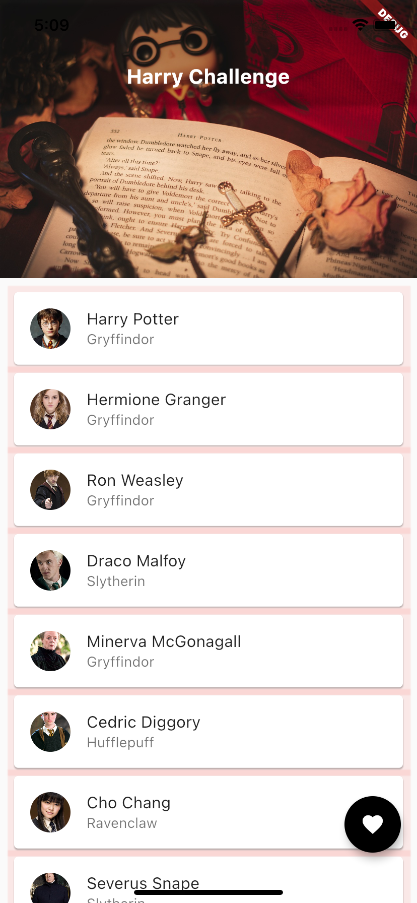
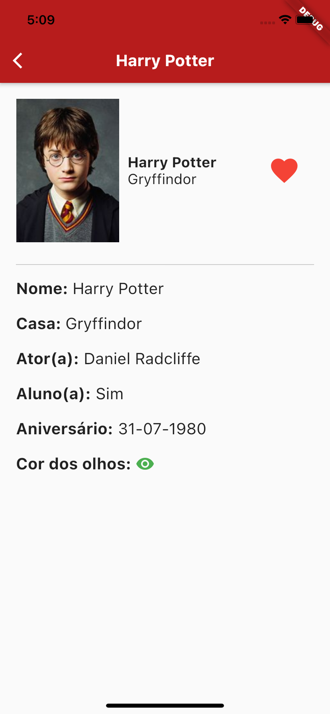
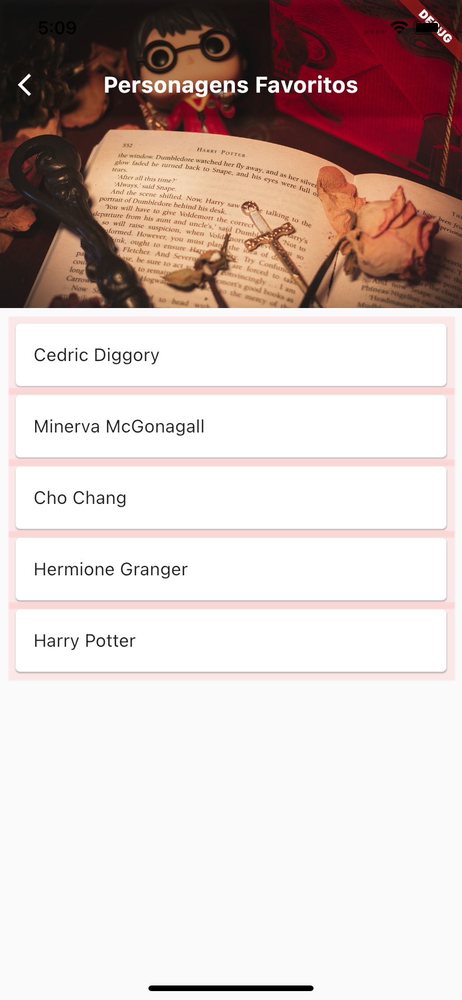

# Desafio Flutter - Semana 2 - Alura + Nubank

## Descrição do projeto

O desafio dessa semana tem como objetivo criar 3 telas:

- Tela de Personagens: onde iremos apresentar uma lista de personagens obtidos por meio de uma API.
- Tela de Detalhamento: iremos apresentar a opção selecionada pelo usuário, além de renderizar as informações do personagem com um botão de favoritar.
- Tela de Favoritos: onde iremos apresentar uma lista de personagens favoritos.

A ideia desse desafio é implementar a persistência de dados, comunicação com APIs e gerenciamento de listas.

## Como executar o aplicativo

#### Requisitos mínimos para executar o projeto

- Instalação do [Flutter 2.2.1](https://docs.flutter.dev/get-started/install)
- Instalação do [Dart 2.13.1](https://docs.flutter.dev/get-started/install)
- Instalação do emulador [Android Studio](https://docs.flutter.dev/get-started/editor?tab=androidstudio) - Para usuários Windows
- Instalação do [Xcode 12.4](https://developer.apple.com/download/all/?q=xcode) + emulador com a versão iOS 10 ou superior - Para usuários macOS.

#### Passo 1 - Instalação das dependências

```
$ flutter install
```

#### Passo 2 - Execução o projeto

```
$ flutter run
```

## Prévia do aplicativo

<table>
  <tr>
    <td>Tela de Personagens</td>
     <td>Tela de Detalhamento</td>
     <td>Tela de Favoritos</td>
  </tr>
  <tr>
    <td></td>
    <td></td>
    <td></td>
  </tr>
 </table>